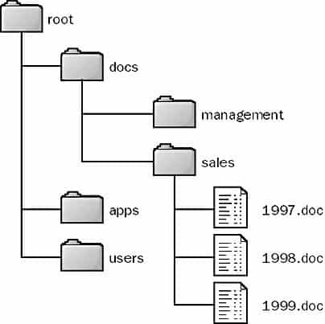

# FileIO & Exceptions

## What is the file?
### It is important to understand what exactly a file is and how modern operating systems deal with some aspects of it.
### A file is a set of bytes used to store data, these byte files are translated into binary 1 and 0 to facilitate processing by the computer.

## File paths
### Each file has a path, this path specifies the location of the file. It is divided into three parts:
* ### Folder path: The location of the file folder on the file system
* ### File name: The actual name of the file
* ### Extension: The end of the file path is pre-clipped with a period (.) used to indicate the file type

### Here's a quick example. The image below indicates the location of the file:

### For example, you want to access the 1999.doc file, and the current location is at root, in order to access the file you need to go through the doc folder and then to sakes then to the 1999.doc file. So the full path is root/docs/sales/1999.doc.

 
 

---

## Opening and closing a file in Python
### Call the built-in function open(). open() has a control over the opening and closing of a file on Python. open() has a single return, the file object:

> #### file = open('dog_breeds.txt')

### It's important to close the file after you've finished working on it. There are two methods you can use to ensure that the file is closed properly, even when you encounter an error. The first way to close the file is to use the try-final block:

> #### reader = open('dog_breeds.txt')
> try:  
&nbsp;&nbsp;&nbsp;&nbsp; Further file processing goes here 
finally: 
&nbsp;&nbsp;&nbsp;&nbsp; reader.close()

### The second way to close a file is to use the with statement:

> #### with open('dog_breeds.txt') as reader:
>&nbsp;&nbsp;&nbsp;&nbsp; #Further file processing goes here

| character | meaning |
| :--------- | :--------- |
|'r'|Open for reading (default)|
|'w'|Open for writing, truncating (overwriting) the file first|
|'rb' or 'wb'|Open in binary mode (read/write using byte data)|

 

 

---

## Reading and writing opened files

### when you opened up a file, you want to read or write to the file.
### I will talk about reading first. There are multiple methods that can used on a file object that let you do what you have in file.

* ### first method is .read(size=-1)
    #### what it does: this method read form the file based on the number of  size bytes. If no argument is passed or None or -1 is passed, then the entire file is read.

* ### sec method .readline(size=-1)
    #### what it does: this method reads at most size number of characters from the line. This continues to the end of the line. If no argument is passed or none or -1 is passed, then the entire line (or the rest of the line) is read.

* ### third method .readlines()
    #### what it does: this method reads the remaining lines from the file object and returns them as a list.