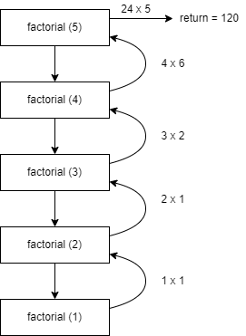
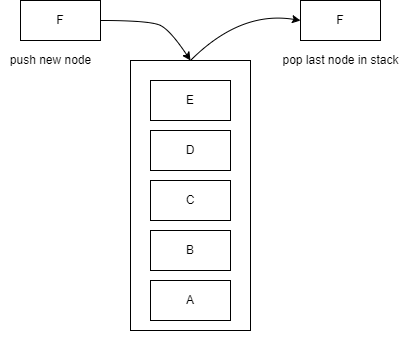

# Intro to OOP

#### Object-oriented programming (OOP) may be a programming worldview based on the concept of "objects", which can contain data and code: data within the shape of areas (frequently known as attributes or properties). A common feature of objects is that procedures (or methods) are connected to them and can get to and modify the object's data fields.
---

## Classes and Objects

### Objects are epitome of variables and functions in a single substance, to assign the above class(template) to an object
### this wiil be look class as the following:

    class nameClass:
        variable = "Hallo"

        def function(self):
            print("This is a message inside the class.")

    myobjectx = MyClass()  # to assign the above class

    myobjectx.variable  # Accessing Object Variables

### To access the variable inside of the newly created object "myobjectx"

### ou'll be able make multiple distinctive objects of the same lesson with the same characterized variables and functions. Be that as it may, each object contains independent copies of the variables characterized within the class.  if we want to characterize another object with class "nameClass" and after that alter the string within the above variable:

    class nameClass:
        variable = "Hallo"

        def function(self):
            print("This is a message inside the class.")

    # to assign the above class 
    myobjectx = MyClass() 
    myobjecty = MyClass() 

    myobjecty.variable = "yackity"

    # Then print out both values
    # Accessing Object Variables
    print(myobjectx.variable)
    print(myobjecty.variable)

    # Accessing Object Functions
    myobjectx.function()

## init()
    The __init__() function is a special function that is called when a class is started. It is used to set the values in the class.

    class NumberHolder:

    def __init__(self, number):
        self.number = number

    def returnNumber(self):
        return self.number

    var = NumberHolder(7)
    print(var.returnNumber()) #Prints '7'

---
 

# What fixtures are

### a fixture provides a defined, reliable and consistent context for the tests.
### The constructs define the steps and data that make up the ordering phase of the test (see Anatomy of the Test). in pytest. Services, state, or other runtime environments created by installations through test functions are accessed through media.
### We can tell pytest that a particular function is a key element by decorating it with @pytest.fixture. Here's a simple example of what a construct might look like in pytest:

    import pytest

    class Fruit:
        def __init__(self, name):
            self.name = name

        def __eq__(self, other):
            return self.name == other.name

    @pitest.fixture
    def my_fruit():
        return Fruit("apple")

    def test_my_fruit_in_basket(my_fruit, fruit_basket):
        assert my_fruit in fruit_basket

## Advancements over xUnit-style setup/teardown functions 
### pytest fixtures offer emotional enhancements over the classic xUnit style of setup/teardown functions: 

* #### fixtures have unequivocal names and are actuated by pronouncing their utilize from test functions, modules, classes or entire projects.

* #### fixtures are executed in a secluded way, as each installation title triggers a installation work which can itself utilize other fixtures. 

* #### fixture administration scales from straightforward unit to complex functional testing, permitting to parametrize fixtures and tests according to arrangement and component alternatives, or to re-use fixtures over function, class, module or entire test session scopes.

* #### teardown logic can be effectively, and securely overseen, no matter how numerous fixtures are utilized, without the have to be carefully handle errors by hand or micromanage the order that cleanup steps are included.

-------
 

# Recursive Functions in Python

### A recursive function is a function defined in terms of itself via self-referential expressions. This means that the function will keep calling itself and repeating its behavior until some condition is met to return a result. All recursive functions share a common structure made up of two parts: base case and recursive case.

 

### To demonstrate this structure, let’s write a recursive function for factorial

 

### Decompose the original problem into simpler instances of the same problem. This is the recursive case:
 

 

    def factorial_recursive(n):
        # Base case: 1! = 1
        if n == 1:
            return 1

        # Recursive case: n! = n * (n-1)!
        else:
            return n * factorial_recursive(n-1)

 
 

## what is Stack(LIFO)
### The first financial audit report will be in the beginning is A, the second is B, etc.
### We push A to the deposit, then we push B etc., the financial audit report will be in order to the last financial audit report is top.
### When an employee starts to undo and redo actions on the financial report being released, he will start from the last action taken which is F then will be the next E etc., the first pop is F, second pop is E, etc.

