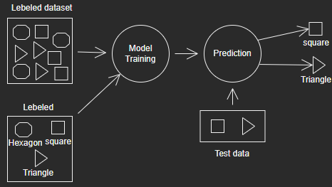

# __Linear Regressions__

#### Regression Analysis: This method models the connection between one or more independent variables and a dependent variable. Linear, multiple, logistic, ridge, non-linear, life data, and other regression models exist.

---

## __What Is Regression?__

#### Regression searches for relationships among variables.

---

## __When Do You Need Regression?__

#### Typically, you need regression to answer whether and how some phenomenon influences the other or how several variables are related.

#### Regression is also useful when you want to __forecast__ a response using a new set of predictors.

#### Regression is used in many different fields, including economics, computer science, and the social sciences. Its importance rises every day with the availability of large amounts of data and increased awareness of the practical value of data.

---

## __Linear Regression__

#### Linear regression is probably one of the most important and widely used regression techniques. It’s among the simplest regression methods. One of its main advantages is the ease of interpreting results.

---

## __Simple Linear Regression With scikit-learn__

#### You’ll start with the simplest case, which is simple linear regression. There are five basic steps when you’re implementing linear regression:

* #### Step 1: Import the packages and classes that you need.

* #### Step 2: Provide data to work with, and eventually do appropriate transformations.

* #### Step 3: Create a regression model and fit it with existing data.

* #### Step 4: Check the results of model fitting to know whether the model is satisfactory.

* #### Step 5: Apply the model for predictions.

#### These steps are more or less general for most of the regression approaches and implementations. Throughout the rest of the tutorial, you’ll learn how to do these steps for several different scenarios.

#### in models are trained utilizing labelled dataset, where the demonstrate learns approximately each type of data. Once the training process is completed, the model is tried on the premise of test data (a subset of the training set), and after that it predicts the output.

### For example:

#### Assume we have a dataset of distinctive types of shapes which incorporates square, triangle, and hexagon. Presently the primary step is that we ought to train the model for each shape. If the given shape has four sides, and all the sides are break even with, at that point it'll be labelled as a Square. If the given shape has three sides, then it'll be labelled as a triangle. If the given shape has six rise to sides at that point it'll be labelled as hexagon. Now, after training, we test our model utilizing the test set, and the task of the model is to identify the shape. The machine is as of now trained on all types of shapes, and when it finds a modern shape, it classifies the shape on the bases of a number of sides, and predicts the output.

---

## Testing and training:

#### Data on Training The observations in the training set provide the learning experience for the algorithm. Each observation in supervised learning problems has an observed output variable and one or more observed input variables.

#### Test Results The test set is a collection of data used to assess the model's performance using a performance measure. It's critical that no observations from the training set make it into the test set. It will be difficult to tell if the algorithm has learnt to generalize from the training set or has just remembered it if the test set contains instances from the training set.

#### This is when we split the data for practicing the model, giving 80% of the data for training, on which we use the algorithm, and the remaining 20% for testing. This allows models to provide accurate forecasts or monitor their behavior to see if they are meeting requirements and serving their function. This is a component of the test.

### Overfitting:

#### This can be due to overtraining, which occurs when a model gets to be as well complex and contains a parcel of noise/irrelevant data that's over-fitted. Generalization, classifications, and general forecasts are not conceivable. When testing, it includes a high rate of mistake, but no loss. when a model learns so much detail and noise within the training data that it seriously affects the model's execution on new data This implies that the model picks up on noise or random fluctuations within the training data and learns them as ideas.

### Underfitting:
#### The model can't deal with the dataset and produces inaccurate results; the model isn't trained sufficiently and will overlook numerous variables below the line, resulting in a large loss, low accuracy, and no logic recorded.

## Let’s quickly go over the libraries I’ve imported:

#### __Pandas__ — to load the data file as a Pandas data frame and analyze the data. If you want to read more on Pandas, feel free to check out my post!

#### From __Sklearn__, I’ve imported the datasets module, so I can load a sample dataset, and the __linear_model__, so I can run a linear regression

#### From __Sklearn__, sub-library model_selection, I’ve imported the __train_test_split__ so I can, well, split to training and test sets

#### From __Matplotlib__ I’ve imported pyplot in order to plot graphs of the data