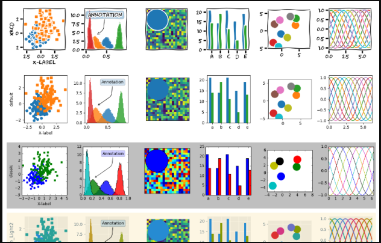

# Data Visualization

#### matplotlib is likely the single most utilized Python package for 2D-graphics. It gives both a really speedy way to visualize data from Python and Publication-quality figures in numerous formats. We are attending to explore matplotlib in intuitively mode covering most common cases.

 

### IPython

#### It is an optimized interactive Python shell that has a lot of interesting features

 

### pyplot

#### pyplot provides a convenient interface to the matplotlib object-oriented layout library. It is modeled closely on Matlab(TM). Therefore, the majority of plot commands in pyplot have Matlab(TM) analogues with similar arguments. Important commands are explained with interactive examples.

## Simple plot
#### In this section, we want to draw the cosine and sine functions on the same plot. Starting from the default settings, we'll enrich the figure step by step to make it nicer.

#### The first step is to get the data for the sine and cosine functions:

    import numpy as np

    X = np.linspace(-np.pi, np.pi, 256, endpoint=True)
    C, S = np.cos(X), np.sin(X)

#### X is now a NumPy array with 256 values ranging from -π to +π (included). C is the cosine (256 values) and S is the sine (256 values).

#### To run the example, you can download each of the examples and run it using:

    $ python exercice_1.py

#### You can get source for each step by clicking on the corresponding figure.

#### Matplotlib comes with a set of default settings that allow to customize all kinds of properties. You can control the default settings for almost every property in matplotlib: shape size and dpi, font width, color and style, axes, axis and grid properties, text and font properties and so on. While matplotlib's defaults are fairly fine in most cases, you may want to tweak some properties for specific cases.

## Figures, Subplots, Axes and Ticks

#### So far we have used implicit figure and axes creation. This is handy for fast plots. We can have more control over the display using figure, subplot, and axes explicitly. A figure in matplotlib means the whole window in the user interface. Within this figure there can be subplots. While subplot positions the plots in a regular grid, axes allows free placement within the figure. Both can be useful depending on your intention. We've already worked with figures and subplots without explicitly calling them. When we call plot, matplotlib calls gca() to get the current axes and gca in turn calls gcf() to get the current figure. If there is none it calls figure() to make one, strictly speaking, to make a subplot(111). Let's look at the details.

### Figures

#### A figure is the windows in the GUI that has "Figure #" as title. Figures are numbered starting from 1 as opposed to the normal Python way starting from 0. This is clearly MATLAB-style. There are several parameters that determine what the figure looks like:

|Argument|Defailt|Description|
|:---------|:---------:|:---------:|
|num|1|number of figure|
|figsize|figure.figsize|figure size in in inches (width, height)|
dpi|figure.dpi|resolution in dots per inch|
facecolor|figure.facecolor|color of the drawing background|
edgecolor|figure.edgecolor|color of edge around the drawing background|
|frameon|True|draw figure frame or not|

#### The defaults can be specified within the asset record and will be utilized most of the time. As it were the number of the figure is as often as possible changed. 

#### When you work with the GUI you'll close a figure by clicking on the x within the upper right corner. You'll be able too close a figure programmatically by calling close. Depending on the contention it closes (1) the current figure (no argument), (2) a specific figure (figure number or figure instance as argument), or (3) all figures (all as argument). 

#### As with other objects, you'll be able set figure properties with the set_something methods.