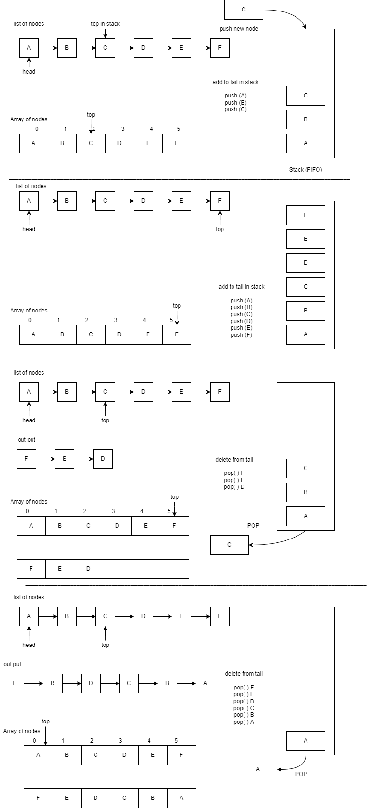
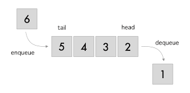
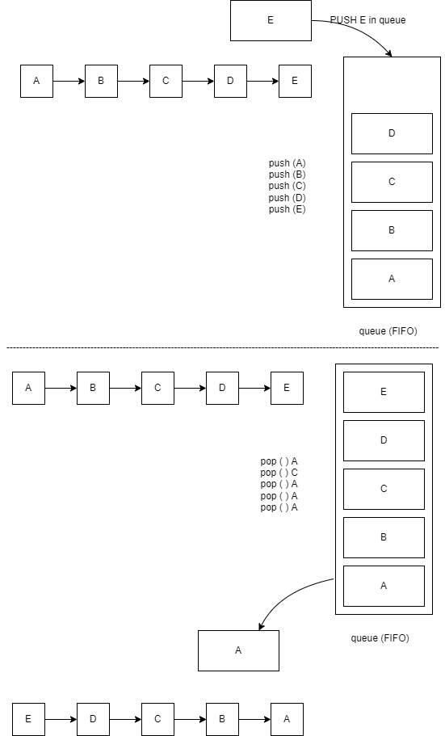

# Stack and Queue

## Stack

#### Within the pushdown stacks as it were two operations are permitted: push the thing into the stack, and pop the thing out of the stack. A stack could be a restricted get to data structure - elements can be included and removed from the stack as it were at the top. push includes an thing to the top of the stack, pop removes the thing from the top. A helpful relationship is to think of a stack of books; you'll remove as it were the top book, moreover you'll be able include a new book on the top.

#### A stack is a linear data structure that follows the principle of Last In First Out (LIFO). This means the last element inserted inside the stack is removed first.

#### You can think of the stack data structure as the pile of plates on top of another.

 

#### LIFO: The first financial audit report will be in the beginning is A, the second is B, etc.

#### We push A to the deposit, then we push B etc., the financial audit report will be in order to the last financial audit report is top.

#### When an employee starts to undo and redo actions on the financial report being released, he will start from the last action taken which is F then will be the next E etc., the first pop is F, second pop is E, etc.

 

#### Here, you can:

* #### Put a new plate on top
* #### Remove the top plate
#### And, if you want the plate at the bottom, you must first remove all the plates on top. This is exactly how the stack data structure works.

 

 

#### We have list A,B,C,D,E and F when we push A than B than C etc, in stack order will be like
#### A,B,C,D,E,F now we pop last in because stack is last in first out (LIFO), pop F from stack than the next is E than D, etc. the order output is F,E,D,C,B,A.

 

 

 

 

### Stack C Code:

    // Arup Guha
    // 6/20/07
    // Written in COP 3502 to illustrate an array implementation of a stack.

    #include <stdio.h>

    // The array will store the items in the stack, first in
    // index 0, then 1, etc. top will represent the index
    // to the top element in the stack. If the stack is 
    // empty top will be -1.

    #define SIZE 10
    #define EMPTY -1

    struct stack {

        int items[SIZE];
        int top;   
    };

    void initialize(struct stack* stackPtr);
    int full(struct stack* stackPtr);
    int push(struct stack* stackPtr, int value);
    int empty(struct stack* stackPtr);
    int pop(struct stack* stackPtr);
    int top(struct stack* stackPtr);

    int main() {
        int i;
        struct stack mine;

        // Set up the stack and push a couple items, then pop one.
        initialize(&mine);
        push(&mine, 4);
        push(&mine, 5);
        printf("Popping %d\n", pop(&mine));
        
        // Push a couple more and test top.
        push(&mine, 22);
        push(&mine, 16);
        printf("At top now = %d\n", top(&mine));
        
        // Pop all three off.
        printf("Popping %d\n", pop(&mine));
        printf("Popping %d\n", pop(&mine));
        printf("Popping %d\n", pop(&mine));
        
        // Checking the empty function.
        if (empty(&mine))
            printf("The stack is empty as expected.\n");
            
        // Fill the stack.
        for (i = 0; i<10; i++)
            push(&mine, i);
        
        // Check if full works.
        if (full(&mine))
            printf("This stack is full as expected.\n");
        
        // Pop everything back off.
        for (i = 0; i<10; i++)
            printf("popping %d\n",pop(&mine));
            
        system("PAUSE");
        return 0;
    }

    void initialize(struct stack* stackPtr) {
        stackPtr->top = -1;
    }

    // If the push occurs, 1 is returned. If the
    // stack is full and the push can't be done, 0 is
    // returned.
    int push(struct stack* stackPtr, int value) {
        
        // Check if the stack is full.
        if (full(stackPtr))
            return 0;
        
        // Add value to the top of the stack and adjust the value of the top.
        stackPtr->items[stackPtr->top+1] = value;
        (stackPtr->top)++;
        return 1;
    }

    // Returns true iff the stack pointed to by stackPtr is full.
    int full(struct stack* stackPtr) {
        return (stackPtr->top == SIZE - 1);
    }

    // Returns true iff the stack pointed to by stackPtr is empty.
    int empty(struct stack* stackPtr) {
        return (stackPtr->top == -1);
    }

    // Pre-condition: The stack pointed to by stackPtr is NOT empty.
    // Post-condition: The value on the top of the stack is popped and returned.
    // Note: If the stack pointed to by stackPtr is empty, -1 is returned.
    int pop(struct stack* stackPtr) {
        
        int retval;
        
        // Check the case that the stack is empty.
        if (empty(stackPtr))
            return EMPTY;
        
        // Retrieve the item from the top of the stack, adjust the top and return
        // the item.
        retval = stackPtr->items[stackPtr->top];
        (stackPtr->top)--;
        return retval;
    }

    // Pre-condition: The stack pointed to by stackPtr is NOT empty.
    // Post-condition: The value on the top of the stack is returned.
    // Note: If the stack pointed to by stackPtr is empty, -1 is returned.
    int top(struct stack* stackPtr) {
        
        // Take care of the empty case.
        if (empty(stackPtr))
            return EMPTY;
        
        // Return the desired item.
        return stackPtr->items[stackPtr->top];
    }

 

## Applications of Stack Data Structure

#### Although stack is a simple data structure to implement, it is very powerful. The most common uses of a stack are:

* #### __To reverse a word__ - Put all the letters in a stack and pop them out. Because of the LIFO order of stack, you will get the letters in reverse order.

* #### ___In compilers___ - Compilers use the stack to calculate the value of expressions like 2 + 4 / 5 * (7 - 9) by converting the expression to prefix or postfix form.

* #### __In browsers__ - The back button in a browser saves all the URLs you have visited previously in a stack. Each time you visit a new page, it is added on top of the stack. When you press the back button, the current URL is removed from the stack, and the previous URL is accessed.

 

---

## Queue:

#### An excellent case of a queue could be a line of understudies within the food court of the UC. New increases to a line made to the back of the queue, whereas evacuation (or serving) happens within the front. Within the line as it were two operations are permitted enqueue and dequeue. Enqueue means to embed an thing into the back of the queue, dequeue implies removing the front thing. The picture illustrates the FIFO get to. The contrast between stacks and queues is in removing. In a stack we remove the thing the foremost as of late included; in a queue, we remove the thing the least as of late added.

 

 

 

#### Similar to stacks, when the order of actions matters. queues are required when the management of data must be done in a which such that the first element in must be the first element out, whilst the other elements wait their turn. For example, if the first financial report arrived to manager then next financial report arrived etc.

#### first financial report arrived must be started because the cost will depend upon the most former cash flows of purchases to be used first. as sometimes it becomes difficult to identify the costs of the products sold at the point of sale and FIFO rectifies the matter.

#### Helps to manage data in FIFO (First In First Out) order.

#### Can handle items of any data type which makes it extremely flexible.

 

 

 

## Useful Applications of Queue

#### When a resource is shared among multiple consumers. Examples include CPU scheduling, Disk Scheduling. 

#### When data is transferred asynchronously (data not necessarily received at the same rate as sent) between two processes. Examples include IO Buffers, pipes, etc. 