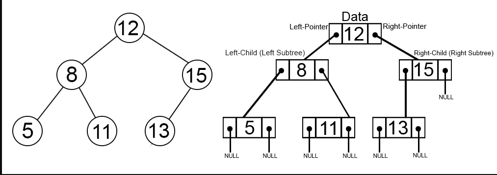
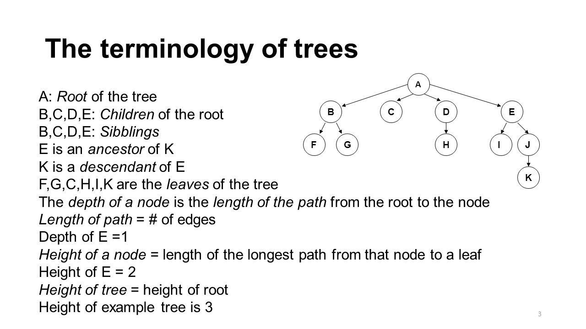
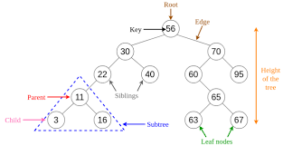

# __Tree__

#### A tree is a non-linear hierarchical data structure consisting of nodes connected by edges.

 

 

### __Why Tree Data Structure?__

##### Other data structures such as arrays, linked list, stack, and queue are linear data structures that store data consecutively. In order to perform any operation in a linear data structure, the time complexity increments with the increment within the data size. But, it isn't worthy in today's computational world. Different tree data structures permit quicker and easier access to the data because it may be a non-linear data structure.

##### It is a data structure that is used to store a collection of data in a hierarchical structure.

 
 

### __Tree Terminologies__

 

#### Node

##### A node is an substance that contains a key or value and pointers to its child nodes. The last nodes of each path are called leaf nodes or external nodes that don't contain a link/pointer to child nodes. The node having at slightest a child node is called an internal node.

 

#### Edge

##### It is the link between any two nodes.

 

#### Root

##### It is the topmost node of a tree.

 

#### Height of a Node

##### The height of a node is the number of edges from the node to the deepest leaf (ie. the longest path from the node to a leaf node).

 

#### Depth of a Node

##### The depth of a node is the number of edges from the root to the node.

 

#### Degree of a Node

##### The degree of a node is the total number of branches of that node.

 

#### Forest

##### A collection of disjoint trees is called a forest.

 

 

 

 

 

 

### Types of Tree

1. Binary Tree
2. Binary Search Tree
3. AVL Tree
4. B-Tree