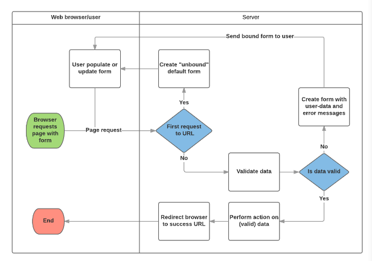

# __Django CRUD and Forms__

### Working with forms

In this instructional exercise, we'll appear you how to work with HTML Forms in Django, and, in particular, the least demanding way to type in forms to form, overhaul, and erase model occurrences. As portion of this demonstration, we'll expand the LocalLibrary website so that librarians can reestablish books, and make, upgrade, and erase authors using our possess forms (instead of utilizing the admin application).

|||
|:---:|:----|
|Prerequisites:|Complete all previous tutorial topics, including [Django Tutorial Part 8: User authentication and permissions.](https://developer.mozilla.org/en-US/docs/Learn/Server-side/Django/Authentication)|
|Objective:|To understand how to set up and use user authentication and permissions.|

---

### Overview

An HTML Shape may be a gather of one or more fields/widgets on a web page, which can be utilized to gather data from users for accommodation to a server. Forms are a adaptable instrument for collecting user input since there are reasonable widgets for entering numerous diverse types of data, counting text boxes, checkboxes, radio buttons, date pickers and so on. Forms are too a generally secure way of sharing data with the server, as they permit us to send data in POST requests with cross-site request fraud protection.

Working with forms can be complicated! Developers need to write HTML for the form, validate and properly sanitize entered data on the server (and possibly also in the browser), repost the form with error messages to inform users of any invalid fields, handle the data when it has successfully been submitted, and finally respond to the user in some way to indicate success. Django Forms take a lot of the work out of all these steps, by providing a framework that lets you define forms and their fields programmatically, and then use these objects to both generate the form HTML code and handle much of the validation and user interaction.

In this tutorial, we're going to show you a few of the ways you can create and work with forms, and in particular, how the generic editing views can significantly reduce the amount of work you need to do to create forms to manipulate your models. Along the way, we'll extend our LocalLibrary application by adding a form to allow librarians to renew library books, and we'll create pages to create, edit and delete books and authors (reproducing a basic version of the form shown above for editing books).

---

### HTML Forms

First, a brief overview of HTML Forms. Consider a simple HTML form

The form is defined in HTML as a collection of elements inside <form>…</form> tags, containing at least one input element of type="submit".

    <form action="/team_name_url/" method="post">
        <label for="team_name">Enter name: </label>
        <input
            id="team_name"
            type="text"
            name="name_field"
            value="Default name for team." />
        <input type="submit" value="OK" />
    </form>

While here we just have one text field for entering the team name, a form may have any number of other input elements and their associated labels. The field's type attribute defines what sort of widget will be displayed. The name and id of the field are used to identify the field in JavaScript/CSS/HTML, while value defines the initial value for the field when it is first displayed. The matching team label is specified using the label tag (see "Enter name" above), with a for field containing the id value of the associated input.

---

### Django form handling process

Django's form handling uses all of the same techniques that we learned about in previous tutorials (for displaying information about our models): the view gets a request, performs any actions required including reading data from the models, then generates and returns an HTML page (from a template, into which we pass a context containing the data to be displayed). What makes things more complicated is that the server also needs to be able to process data provided by the user, and redisplay the page if there are any errors.

A process flowchart of how Django handles form requests is shown below, starting with a request for a page containing a form (shown in green).

Based on the diagram above, the main things that Django's form handling does are:

1. Display the default form the first time it is requested by the user.

    * The form may contain blank fields if you're creating a new record, or it may be pre-populated with initial values (for example, if you are changing a record, or have useful default initial values).

    * The form is referred to as unbound at this point, because it isn't associated with any user-entered data (though it may have initial values).
    
2. Receive data from a submit request and bind it to the form.

    * Binding data to the form means that the user-entered data and any errors are available when we need to redisplay the form.

3. Clean and validate the data.

    * Cleaning the data performs sanitization of the input fields, such as removing invalid characters that might be used to send malicious content to the server, and converts them into consistent Python types.

    * Validation checks that the values are appropriate for the field (for example, that they are in the right date range, aren't too short or too long, etc.)

4. If any data is invalid, re-display the form, this time with any user populated values and error messages for the problem fields.

5. If all data is valid, perform required actions (such as save the data, send an email, return the result of a search, upload a file, and so on).

6. Once all actions are complete, redirect the user to another page.

---

### Renew-book form using a Form and function view

Next, we're going to add a page to allow librarians to renew borrowed books. To do this we'll create a form that allows users to enter a date value. We'll seed the field with an initial value 3 weeks from the current date (the normal borrowing period), and add some validation to ensure that the librarian can't enter a date in the past or a date too far in the future. When a valid date has been entered, we'll write it to the current record's BookInstance.due_back field.

The example will use a function-based view and a Form class. The following sections explain how forms work, and the changes you need to make to our ongoing LocalLibrary project.

 

__Form__

The Form class is the heart of Django's form handling system. It specifies the fields in the form, their layout, display widgets, labels, initial values, valid values, and (once validated) the error messages associated with invalid fields. The class also provides methods for rendering itself in templates using predefined formats (tables, lists, etc.) or for getting the value of any element (enabling fine-grained manual rendering).

 

__Declaring a Form__

The declaration syntax for a Form is very similar to that for declaring a Model, and shares the same field types (and some similar parameters). This makes sense because in both cases we need to ensure that each field handles the right types of data, is constrained to valid data, and has a description for display/documentation.

Form data is stored in an application's forms.py file, inside the application directory. Create and open the file locallibrary/catalog/forms.py. To create a Form, we import the forms library, derive from the Form class, and declare the form's fields. A very basic form class for our library book renewal form is shown below — add this to your new file:

    from django import forms

    class RenewBookForm(forms.Form):
        renewal_date = forms.DateField(help_text="Enter a date between now and 4 weeks (default 3).")

---

### Form fields

In this case, we have a single DateField for entering the renewal date that will render in HTML with a blank value, the default label "Renewal date:", and some helpful usage text: "Enter a date between now and 4 weeks (default 3 weeks)." As none of the other optional arguments are specified the field will accept dates using the input_formats: YYYY-MM-DD (2016-11-06), MM/DD/YYYY (02/26/2016), MM/DD/YY (10/25/16), and will be rendered using the default widget: DateInput.

There are many other types of form fields, which you will largely recognize from their similarity to the equivalent model field classes:

* BooleanField
* CharField
* ChoiceField
* TypedChoiceField
* DateField
* DateTimeField
* DecimalField
* DurationField
* EmailField
* FileField
* FilePathField
* FloatField
* ImageField
* IntegerField
* GenericIPAddressField
* MultipleChoiceField
* TypedMultipleChoiceField
* NullBooleanField
* RegexField
* SlugField
* TimeField
* URLField
* UUIDField
* ComboField
* MultiValueField
* SplitDateTimeField
* ModelMultipleChoiceField
* ModelChoiceField

The arguments that are common to most fields are listed below (these have sensible default values):

* __required:__ If True, the field may not be left blank or given a None value. Fields are required by default, so you would set required=False to allow blank values in the form.

* __label:__ The label to use when rendering the field in HTML. If a label is not specified, Django will create one from the field name by capitalizing the first letter and replacing underscores with spaces (e.g. Renewal date).

* __label_suffix:__ By default, a colon is displayed after the label (e.g. Renewal date​:). This argument allows you to specify a different suffix containing other character(s).

* __initial:__ The initial value for the field when the form is displayed.

* __widget:__ The display widget to use.
help_text (as seen in the example above): Additional text that can be displayed in forms to explain how to use the field.

* __error_messages:__ A list of error messages for the field. You can override these with your own messages if needed.

* __validators:__ A list of functions that will be called on the field when it is validated.

* __localize:__ Enables the localization of form data input (see link for more information).

* __disabled:__ The field is displayed but its value cannot be edited if this is True. The default is False.

---

### Validation

    Django provides numerous places where you can validate your data. The easiest way to validate a single field is to override the method clean_<fieldname>() for the field you want to check. So for example, we can validate that entered renewal_date values are between now and 4 weeks by implementing clean_renewal_date() as shown below.

 

    from django import forms

    from django.core.exceptions import ValidationError
    from django.utils.translation import gettext_lazy as _

    class RenewBookForm(forms.Form):
        renewal_date = forms.DateField(help_text="Enter a date between now and 4 weeks (default 3).")

        def clean_renewal_date(self):
            data = self.cleaned_data['renewal_date']

            # Check if a date is not in the past.
            if data < datetime.date.today():
                raise ValidationError(_('Invalid date - renewal in past'))

            # Check if a date is in the allowed range (+4 weeks from today).
            if data > datetime.date.today() + datetime.timedelta(weeks=4):
                raise ValidationError(_('Invalid date - renewal more than 4 weeks ahead'))

            # Remember to always return the cleaned data.
            return data